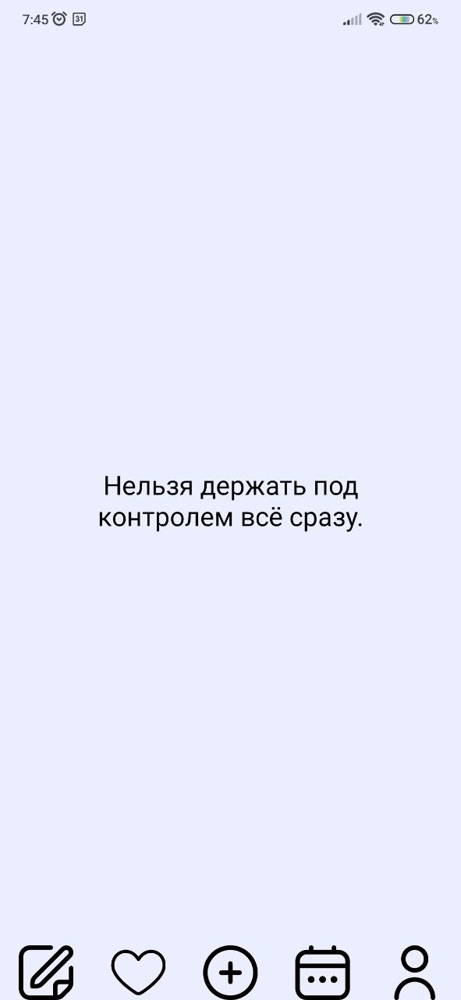
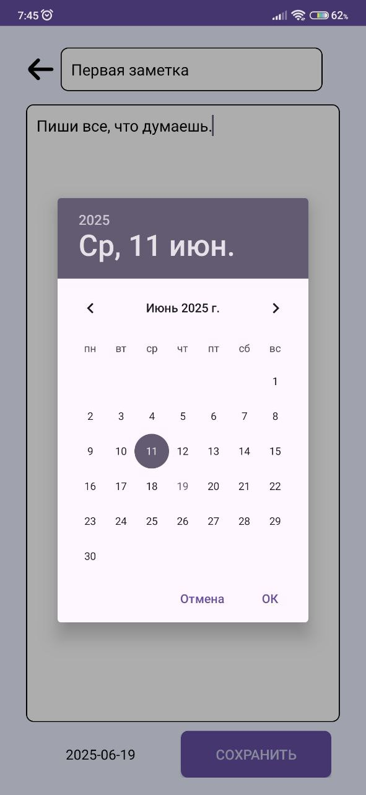
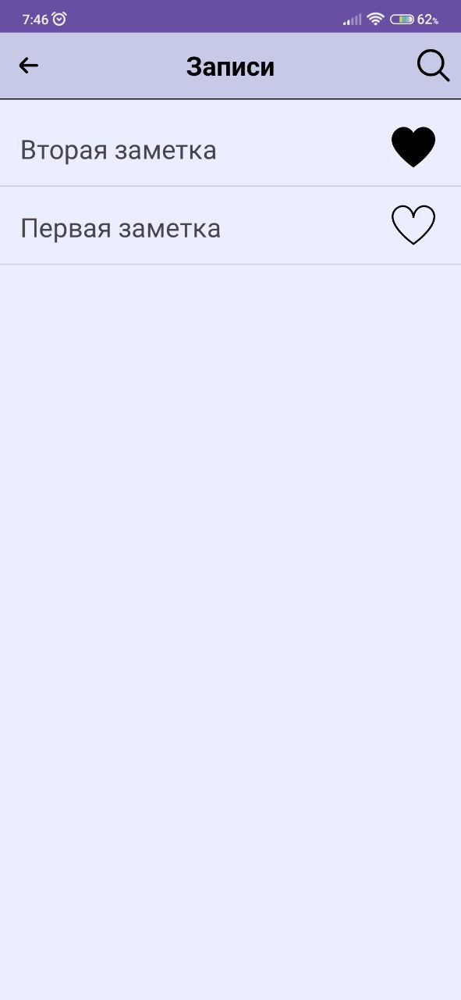
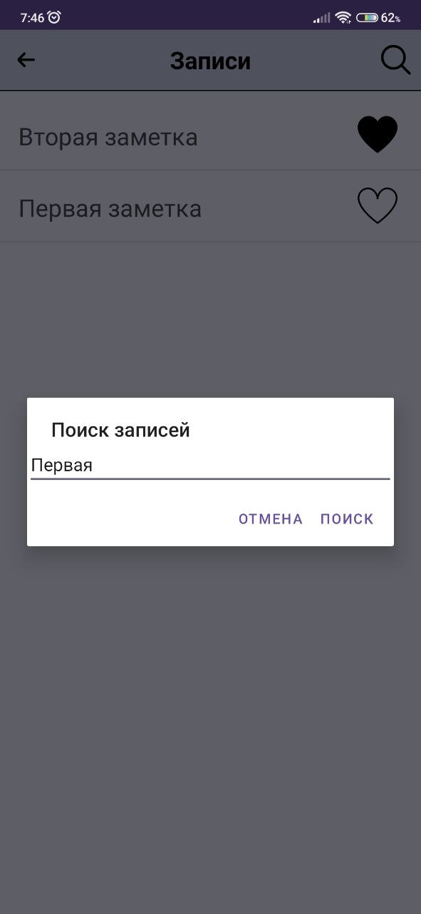
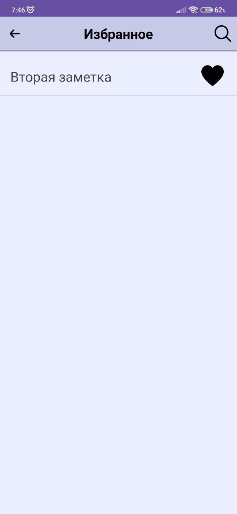
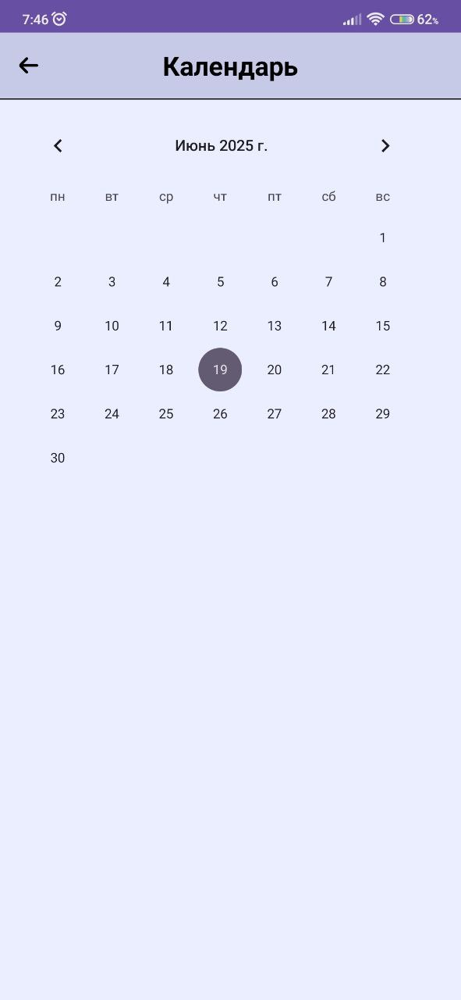
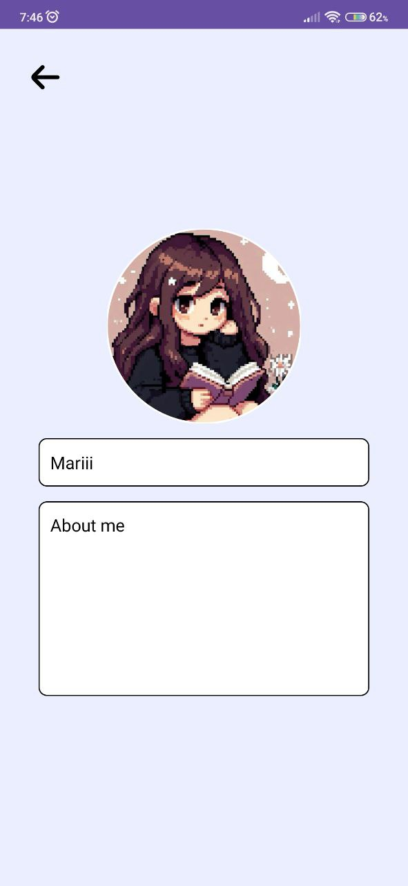

# DayFlow

DayFlow — это мобильное приложение для Android, разработанное для ведения личного дневника. Приложение позволяет пользователям создавать, редактировать и организовывать записи, а также просматривать их в удобном формате, включая календарь и список избранного.

## Описание

DayFlow помогает пользователям вести дневник или записывать важные моменты с возможностью быстрого доступа к избранным записям и просмотра дат создания на календаре. Интерфейс интуитивно понятен, а функционал охватывает основные потребности в управлении личными заметками.

## Функциональность

- **Создание и редактирование заметок:** Пользователи могут добавлять новые заметки с заголовком, текстом и датой создания. Заметки автоматически сортируются от новых к старым.
- **Избранное:** Возможность отмечать заметки как избранные и просматривать их в отдельном разделе. Избранные заметки также сортируются.
- **Календарь:** Отображение дней, в которые были созданы заметки, прямо на календаре.
- **Поиск:** Функция поиска позволяет находить заметки по заголовкам как в общем списке, так и в избранном через диалоговое окно.
- **Навигация:** Удобное переключение между экранами (заметки, избранное, календарь, профиль) с возможностью возврата на предыдущий экран при нажатии кнопки "Назад".

## Инструкции по использованию

- **Главная страница:** Содержит кнопки для перехода к заметкам, избранному, календарю и профилю.
  
  

- **Заметки:** Нажми на кнопку "Добавить заметку" для создания новой записи.
  
      

- **Поиск**: Используй кнопку поиска для фильтрации по заголовкам.
  
  

- **Избранное:** Отмечай заметки как избранные и управляй ими с помощью поиска.
  
  

- **Календарь:** Просматривай дни с заметками.
  
  

- **Профиль:** Показывает информацию о пользователе - его фотографию, имя и описание.
  
  

## Будущие улучшения

- Добавление отображения на календаре созданных заметок и переход к ним.
- Поддержка тем оформления.
- Расширенный поиск с фильтрами по дате.
